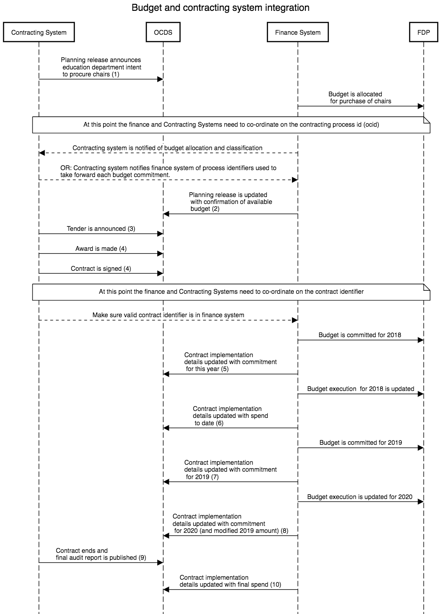
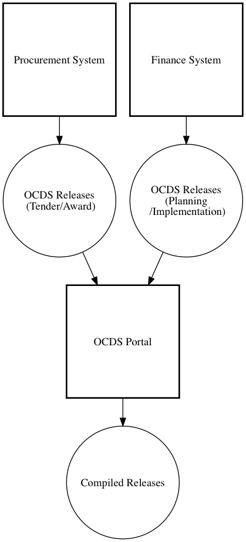
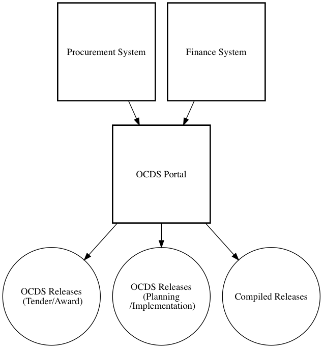

# Worked example

In this worked example we explore how data published by two separate systems can be made available with the OCDS Budget and Spend extension and Fiscal Data Package.

We describe the case where:

* A **contracting system** exists which handles information on planning, tenders, awards and contracts;
* A **finance system** exists which handles budget allocations and information on spending.

Whilst the OCDS approach to data integration and change history supports publishers to bring together data from different systems, there is still a need for co-ordination between these systems to develop a strategy for connecting **process** (`ocid`) and **contract** `contract/id` identifiers. 

## Prose description

The education department plan to purchase replacement chairs for local schools. Past experience shows that they get best value when agreeing 2 - 3 year long contracts for the supply of chairs. 

They anticipate that they will need to replace around USD 10,000 worth of chairs over the next two years. 

They tender and make an award, signing a contract with the supplier shortly afterwards. 

The finance department commit budget on a yearly basis. When the project starts, USD 5,000 is committed. The next year, an additional USD 5,000 is committed. As not all of this is spent in year 2, the contract continues into year 3, with the remaining 2,000 committed in year 3. 

At the end of the contract, the education department file a report to confirm delivery of all the chairs. 

## Interaction diagram

The diagram below shows the two systems (contracting and finance), and the two open datasets (OCDS and Fiscal Data Package) being updated. Read from top to bottom each arrow represents either data publication, or an exchange of information between the systems.

| Figure 1 | 
|----------|
|  |

### Notes

* This is a simplified process. In reality, there may be many more steps and updates that take place, and more detail than the example JSON files contain. Real world cases may vary in the order of the steps (e.g. the commitment of budget to a contract may need to take place *prior* to the contract being signed, adding a number of extra steps around (4) and (5)).

* In the example above, the finance system is responsible for both publishing Fiscal Data Package data **and** publishing OCDS releases for each update to financial allocations. To do this, it needs the know the contracting process identifier (ocid) and contract identifier of the relevant contract. 

* When identifiers are used consistently, then these releases can be merged to create a record that gives an overview of the process.

* Depending on the architecture of data production, instead of two different systems producing OCDS releases which are then merged (as in figure 2 below), data may be passed to a single system which produces OCDS release (as in figure 3 below).

| Figure 2: independent publishing | Figure 3: merged before publication  |
|----------|----------| 
|  |  |

## Releases

In this worked example there are 10 releases, and then a compiledRelease that provides a view of the information that would be presented at the end of the process. You can click through to view each individual release. Extracts from each one are show, with only the key fields displayed. 

(1) The **Department of Education** describes the original plan to procure chairs, as well as including the planned budget.

*Extract from [1-contract-planning.json](1-contract-planning.json)*

```json
{
      "ocid": "ocds-4f64a2-exbas-01",
      "id": "ocds-4f64a2-exbas-01-planning",
      "planning": {
        "rationale": "Purchase of chairs for schools",
        "budget": {
          "description": "Administrative: Education; Economic: Goods; Functional: Equipment",
          "amount": {
            "amount": 10000,
            "currency": "USD"
          }
        }
      },
      "tender": {
        "id": "01",
        "title": "Proposed tender for chairs",
        "description": "We will be purchasing chairs during the coming year.",
        "status": "planning",
        "value": {
          "amount": 10000,
          "currency": "USD"
        }
    }
}
```

(2) The **Finance Department** provide a release using the budgetBreakdown extension with the committed amount (5000) and a set of budget classifications that can be used to lookup the corresponding line of a Fiscal Data Package

*Extract from [2-finance-budget.json](2-finance-budget.json)*

```json
{
      "ocid": "ocds-4f64a2-exbas-01",
      "id": "budget-system-identifier-12345",
      "tag": [
        "planningUpdate"
      ],
      "initiationType": "tender",
      "planning": {
        "budget": {
          "budgetBreakdown":[{
            "id":"2018/ED01/ED01-FAC/EQ01",
            "period":{
                "startDate":"2018-01-01T00:00:00Z",
                "endDate":"2018-12-31T23:23:59Z"
            },
            "classifications":{
              "Dept":"ED01",
              "Team":"ED01-FAC",
              "Economic":"Goods",
              "Func":"EQ01"
            },
            "measures":{
              "Committed":5000
            }
          }],
          "financialBreakdownFieldMapping":"ofdp.json#budget.csv"
        }
      }
    }

```

Note that if a compiledRelease was generated at this point from these two data releases, it would contain **both** the budget amount sought by the education department, and the budget commitment made, showing that the overall project budget sought, and planned tender amount, is USD 10000, but that only USD 5000 is committed at present. 

(3) The **Department of Education** then open their tender process, publishing a tender release.

*See [3-contract-tender.json](3-contract-tender.json)*

(4) When they award the contract, the Department of Education publish a release containing information on the award, and the contract. 

*Extract from [4-contract-award.json](4-contract-award.json)*

```json
{
      "ocid": "ocds-4f64a2-exbas-01",
      "id": "ocds-4f64a2-exbas-04-award",
      "tag": [
        "award",
        "contract"
      ],
      "awards": [
        {
          "id": "ocds-4f64a2-exbas-04-award-1",
          "date": "2018-03-15T09:00:00Z",
          "description": "AnyCorp Ltd have been awarded the contract to supply chairs over the next three years.",
          "suppliers": [
            {
              "id": "GB-COH-11111111",
              "name": "AnyCorp Cycle Provision"
            }
          ],
          "value": {
            "amount": 10000,
            "currency": "USD"
          },
          "contractPeriod": {
            "startDate": "2018-05-01T00:00:00Z",
            "endDate": "2020-12-31T23:59:00Z"
          }
        }
      ],
      "contracts": [
        {
          "id": "ocds-4f64a2-exbas-04-contract-1",
          "awardID": "ocds-4f64a2-exbas-04-award-1",
          "date": "2018-03-16T09:00:00Z",
          "status": "active"
        }
      ]
    }
```

At this point, there is both a contracting process identifier `"ocid":"ocds-4f64a2-exbas-01"`, and a contract identifier `"contracts":[{"id":"ocds-4f64a2-exbas-04-contract-1"}]`. The finance system will need both these identifiers in order to publish information about the budget committed to this specific contract. 

The contract has been awarded for up to USD 10000 for three years, but at present only budget for the first year is secured. 

Where the finance system does not deal at the contract level (recognising that a single contracting process could have many contracts), then integration at the contract level may not be possible, and instead of the approach taken in the following releases, updates would be made to the `planning/budget/budgetBreakdown` section to reflect new budget allocations to a contracting process, rather than to a specific contact. 

(5) The **Finance Department** confirm that USD 5000 is committed to paying for this contract.

*Extract from [5-finance-commitment.json](5-finance-commitment.json)*

```json
 
    {
      "ocid": "ocds-4f64a2-exbas-01",
      "id": "budget-system-identifier-87654",
      "date": "2018-03-16T09:00:00Z",
      "tag": [
        "implementation"
      ],
      "initiationType": "tender",
      "contracts": [
        {
          "id": "ocds-4f64a2-exbas-04-contract-1",
          "awardID": "ocds-4f64a2-exbas-04-award-1",
          "implementation": {
            "financialProgress": {
              "breakdown": [
                {
                  "id": "2018/ED01/ED01-FAC/EQ01",
                  "period": {
                    "startDate": "2018-01-01T00:00:00Z",
                    "endDate": "2018-12-31T23:23:59Z"
                  },
                  "measures": {
                    "Committed": 5000
                  }
                }
              ]
            }
          }
        }
      ]
    }
```

(6) As invoices are processed, the Finance Department publish a new release showing the amount paid to date in the last financial period

*Extract from [6-finance-update.json](6-finance-update.json)*

```json
 {
      "ocid": "ocds-4f64a2-exbas-01",
      "id": "budget-system-identifier-34666531",
      "date": "2018-11-01T09:00:00Z",
      "tag": [
        "implementation"
      ],
      "initiationType": "tender",
      "contracts": [
        {
          "id": "ocds-4f64a2-exbas-04-contract-1",
          "awardID": "ocds-4f64a2-exbas-04-award-1",
          "implementation": {
            "financialProgress": {
              "breakdown": [
                 {
                  "id": "2018/ED01/ED01-FAC/EQ01",
                  "period": {
                    "startDate": "2018-01-01T00:00:00Z",
                    "endDate": "2018-12-31T23:23:59Z"
                  },
                  "measures": {
                    "Committed": 5000,
                    "Paid":5000
                  }
                }
              ]
            }
          }
        }
      ]
    }
```

**Note:** The names of measures here (Committed / Paid) are arbitrary, and are not specified by OCDS or OCDS extensions. Instead they can reflect any terms in use within the corresponding Fiscal Data Package to represent various budget planning and execution measures. A `"financialBreakdownFieldMapping"` property can be used to point to a Fiscal Data Package JSON file that contains labels and definitions for these measures. 

(7) As commitments are made for the next financial year, the **Finance Department** may publish a new release providing an additional entry in the `financialProgress` array. 

*See [7-finance-commitment-2.json](7-finance-commitment-2.json)*

In line with the OCDS model for merging data, this release could contain all budget allocations and measures to date (i.e. the allocation from 2018, and that for 2019), **or** it can contain only the new years data, as long as the `id` value for the entry in the `breakdown` array is also new.

When a compiledRelease is created, it will combine array entries to provide the latest information provided for each year. 

(8) The **Finance Department** review spending for 2019 and discover an underspend. They process a budget modification, reducing the allocation for 2019, and allocating a remainder into 2020.

*Extract from [8-finance-commitment-3.json](8-finance-commitment-3.json)*

```json
 {
      "ocid": "ocds-4f64a2-exbas-01",
      "id": "budget-system-identifier-85451683",
      "date": "2019-11-01T09:00:00Z",
      "tag": [
        "implementation"
      ],
      "initiationType": "tender",
      "contracts": [
        {
          "id": "ocds-4f64a2-exbas-04-contract-1",
          "awardID": "ocds-4f64a2-exbas-04-award-1",
          "implementation": {
            "financialProgress": {
              "breakdown": [
                 {
                  "id": "2019/ED01/ED01-FAC/EQ01",
                  "period": {
                    "startDate": "2019-01-01T00:00:00Z",
                    "endDate": "2019-12-31T23:23:59Z"
                  },
                  "measures": {
                    "Committed": 5000,
                    "Modified":3000,
                    "Paid":3000
                  }
                },
                {
                  "id": "2020/ED01/ED01-FAC/EQ01",
                  "period": {
                    "startDate": "2020-01-01T00:00:00Z",
                    "endDate": "2020-12-31T23:23:59Z"
                  },
                  "measures": {
                    "Committed": 2000
                  }
                }
              ]
            }
          }
        }
      ]
    }
```

(9) The final chairs are delivered, and the **Department of Education** publishes an audit report, and updates the contract status to terminated to indicate all work is complete. 

*Extract from [9-contract-close.json](9-contract-close.json)*

```json
    {
      "ocid": "ocds-4f64a2-exbas-01",
      "id": "ocds-4f64a2-exbas-09-close",
      "date": "2020-02-01T09:00:00Z",
      "tag": [
        "implementation"
      ],
      "contracts": [
        {
          "id": "ocds-4f64a2-exbas-04-contract-1",
          "awardID": "ocds-4f64a2-exbas-04-award-1",
          "date": "2018-03-16T09:00:00Z",
          "status": "terminated",
          "period": {
            "startDate": "2018-05-01T00:00:00Z",
            "endDate": "2020-12-31T23:59:00Z"
          },
          "implementation": {
            "documents": [
              {
                "id": "7.0",
                "documentType": "finalAudit",
                "title": "Final Audit",
                "description": "Final audit report from the delivery of the chairs.",
                "url": "http://example.com/reports/ocds-4f64a2-exbas-01.html",
                "datePublished": "2020-02-10T10:30:00Z",
                "format": "text/html",
                "language": "en"
              }
            ]
          }
        }
      ]
    }
```

(10) The final payments are processed through the finance system, and year end completed. The **Finance Department** publishes a release that shows the final payment made.

*Extract from [10-finance-update-final.json](10-finance-update-final.json)*

```json
{
      "ocid": "ocds-4f64a2-exbas-01",
      "id": "budget-system-identifier-95729675",
      "date": "2021-01-01T09:00:00Z",
      "tag": [
        "implementation"
      ],
      "initiationType": "tender",
      "contracts": [
        {
          "id": "ocds-4f64a2-exbas-04-contract-1",
          "awardID": "ocds-4f64a2-exbas-04-award-1",
          "status":"terminated",
          "implementation": {
            "financialProgress": {
              "breakdown": [
                {
                  "id": "2020/ED01/ED01-FAC/EQ01",
                  "period": {
                    "startDate": "2020-01-01T00:00:00Z",
                    "endDate": "2020-12-31T23:23:59Z"
                  },
                  "measures": {
                    "Paid":1950
                  }
                }
              ]
            }
          }
        }
      ]
    } 
```

## Record

At each stage of this process, an updated compiledRelease should be created to provide a summary of all the information to date. 

Below is the compiledRelease that would be available **at the end of the process** containing the latest version of all the information given.

```json
{
  "ocid": "ocds-4f64a2-exbas-01",
  "id": "ocds-4f64a2-exbas-01-compiled",
  "date": "2021-01-01T09:00:00Z",
  "initiationType": "tender",
  "tag": [
    "compiled"
  ],
  "buyer": {
    "id": "EX-EXAMPLE-0235",
    "name": "Department of Education"
  },
  "parties": [
    {
      "id": "EX-EXAMPLE-0235",
      "identifier": {
        "id": "0235",
        "legalName": "Department of Education",
        "scheme": "EX-EXAMPLE"
      },
      "name": "Department of Education",
      "roles": [
        "buyer"
      ]
    },
    {
      "address": {
        "countryName": "United Kingdom",
        "locality": "Anytown",
        "postalCode": "AA1 1AA",
        "region": "Any County",
        "streetAddress": "1 Anytown Lane"
      },
      "contactPoint": {
        "email": "contracts@anycorp.example",
        "faxNumber": "11111 111 112",
        "name": "Contracts Team",
        "telephone": "11111 111 111",
        "url": "http://www.anycorp.example"
      },
      "id": "GB-COH-11111111",
      "identifier": {
        "id": "11111111.0",
        "legalName": "AnyCorp Ltd",
        "scheme": "GB-COH"
      },
      "name": "AnyCorp Ltd",
      "roles": [
        "supplier"
      ]
    }
  ],
  "planning": {
    "budget": {
      "amount": {
        "amount": 10000,
        "currency": "USD"
      },
      "budgetBreakdown": [
        {
          "classifications": {
            "Dept": "ED01",
            "Economic": "Goods",
            "Func": "EQ01",
            "Team": "ED01-FAC"
          },
          "id": "2018/ED01/ED01-FAC/EQ01",
          "measures": {
            "Committed": 5000
          },
          "period": {
            "endDate": "2018-12-31T23:23:59Z",
            "startDate": "2018-01-01T00:00:00Z"
          }
        }
      ],
      "description": "Administrative: Education; Economic: Goods; Functional: Equipment",
      "financialBreakdownFieldMapping": "ofdp.json#budget.csv"
    },
    "rationale": "Purchase of chairs for schools"
  },
  "tender": {
    "contractPeriod": {
      "endDate": "2020-12-31T23:23:59Z",
      "startDate": "2018-04-01T00:00:00Z"
    },
    "description": "We will be purchasing chairs during the coming year.",
    "id": "01",
    "items": [
      {
        "classification": {
          "description": "Chairs",
          "id": "39112000",
          "scheme": "CPV"
        },
        "description": "Chairs",
        "id": "01"
      }
    ],
    "mainProcurementCategory": "goods",
    "minValue": {
      "amount": 2000,
      "currency": "USD"
    },
    "numberOfTenderers": 8,
    "procurementMethod": "open",
    "status": "active",
    "tenderPeriod": {
      "durationInDays": 30,
      "endDate": "2018-03-01T00:00:00Z",
      "startDate": "2018-02-01T00:00:00Z"
    },
    "title": "Proposed tender for chairs",
    "value": {
      "amount": 10000,
      "currency": "USD"
    }
  },
  "awards": [
    {
      "contractPeriod": {
        "endDate": "2020-12-31T23:59:00Z",
        "startDate": "2018-05-01T00:00:00Z"
      },
      "date": "2018-03-15T09:00:00Z",
      "description": "AnyCorp Ltd have been awarded the contract to supply chairs over the next three years.",
      "id": "ocds-4f64a2-exbas-04-award-1",
      "suppliers": [
        {
          "id": "GB-COH-11111111",
          "name": "AnyCorp Cycle Provision"
        }
      ],
      "value": {
        "amount": 10000,
        "currency": "USD"
      }
    }
  ],
  "contracts": [
    {
      "awardID": "ocds-4f64a2-exbas-04-award-1",
      "date": "2018-03-16T09:00:00Z",
      "dateSigned": "2018-03-16T09:00:00Z",
      "id": "ocds-4f64a2-exbas-04-contract-1",
      "status": "terminated",
      "value": {
        "amount": 10000,
        "currency": "USD"
      },
      "items": [
        {
          "classification": {
            "description": "Chairs",
            "id": "39112000",
            "scheme": "CPV"
          },
          "description": "Chairs",
          "id": "01"
        }
      ],
      "period": {
        "endDate": "2020-12-31T23:59:00Z",
        "startDate": "2018-05-01T00:00:00Z"
      },
      "implementation": {
        "financialProgress": {
          "breakdown": [
            {
              "id": "2018/ED01/ED01-FAC/EQ01",
              "measures": {
                "Committed": 5000,
                "Paid": 5000
              },
              "period": {
                "endDate": "2018-12-31T23:23:59Z",
                "startDate": "2018-01-01T00:00:00Z"
              }
            },
            {
              "id": "2019/ED01/ED01-FAC/EQ01",
              "measures": {
                "Committed": 5000,
                "Modified": 3000,
                "Paid": 3000
              },
              "period": {
                "endDate": "2019-12-31T23:23:59Z",
                "startDate": "2019-01-01T00:00:00Z"
              }
            },
            {
              "id": "2020/ED01/ED01-FAC/EQ01",
              "measures": {
                "Committed": 2000,
                "Paid": 1950
              },
              "period": {
                "endDate": "2020-12-31T23:23:59Z",
                "startDate": "2020-01-01T00:00:00Z"
              }
            }
          ]
        },
        "documents": [
          {
            "datePublished": "2020-02-10T10:30:00Z",
            "description": "Final audit report from the delivery of the chairs.",
            "documentType": "finalAudit",
            "format": "text/html",
            "id": "7.0",
            "language": "en",
            "title": "Final Audit",
            "url": "http://example.com/reports/ocds-4f64a2-exbas-01.html"
          }
        ]
      }
    }
  ]
}
```

### Tabular representation

Using [flatten-tool](https://flatten-tool.readthedocs.io/en/latest/) to convert this to a spreadsheet representation, the `contract/implementation/financialProgress` would appear as follows, showing a row for each period reported on, and the initial commitment or modified amount. 

| ocid                 | id                            | contracts/ 0/ id                  | contracts/ 0/ implementation/ financialProgress/ breakdown/ 0/ id | contracts/ 0/ implementation/ financialProgress/ breakdown/ 0/ period/ startDate | contracts/ 0/ implementation/ financialProgress/ breakdown/ 0/ period/ endDate | contracts/ 0/ implementation/ financialProgress/ breakdown/ 0/ measures/ Committed | contracts/ 0/ implementation/ financialProgress/ breakdown/ 0/ measures/ Modified | contracts/ 0/ implementation/ financialProgress/ breakdown/ 0/ measures/ Paid |  
|----------------------|-------------------------------|---------------------------------|-------------------------------------------------------------|-----------------------------------------------------------------------------|------------------------------------------------------------------------|-------------------------------------------------------------------------|---------------------------------------------------------------------------|----------------------------------------------------------------------------| 
| ocds-4f64a2-exbas-01 | ocds-4f64a2-exbas-01-compiled | ocds-4f64a2-exbas-04-contract-1 | 2018/ED01/ED01-FAC/EQ01 | 2018-01-01T00:00:00Z | 2018-12-31T23:23:59Z | 5000 |      | 5000 | 
| ocds-4f64a2-exbas-01 | ocds-4f64a2-exbas-01-compiled | ocds-4f64a2-exbas-04-contract-1 | 2019/ED01/ED01-FAC/EQ01 | 2019-01-01T00:00:00Z | 2019-12-31T23:23:59Z | 5000 | 3000 | 3000 | 
| ocds-4f64a2-exbas-01 | ocds-4f64a2-exbas-01-compiled | ocds-4f64a2-exbas-04-contract-1 | 2020/ED01/ED01-FAC/EQ01 | 2020-01-01T00:00:00Z | 2020-12-31T23:23:59Z | 2000 |      | 1950 | 

## Additional notes

This worked example does not currently include the Fiscal Data Package component. If this was included in more detail it would show how:

* The Fiscal Data Package description file can be used to provide meta-data about budget measures and dimensions;
* Financial progress at the `contracts/implementation` level can also be broken down according to budget classifications;
* The contracting process and contract level budget commitments and execution can be compared to higher-level budget allocation information available in the Fiscal Data Package.

